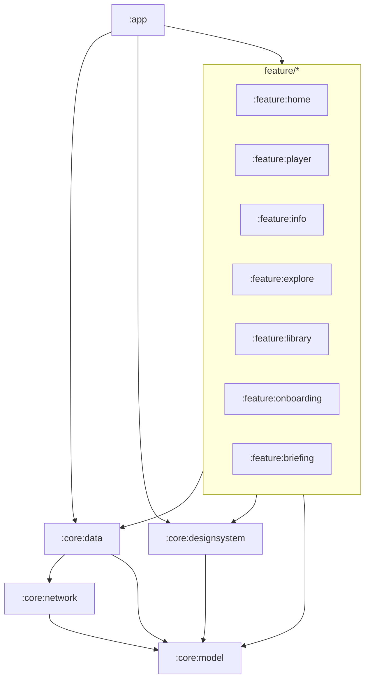

# Boxlore architecture

Cross-module map for the Android app. Module-local detail lives in each module’s `README.md` (see `docs/MODULE_README_TEMPLATE.md`).

## Product invariants

- **`applicationId`** stays `cx.aswin.boxlore` (do not change for package renames).
- **One UI `PlaybackRepository`** — never recreate per route or worker.
- **Construction order** for shared graph: DB → `PodcastRepository` → `QueueRepository` → `PlaybackRepository` → `QueueManager` → `SmartDownloadManager`.
- Smart Queue auto-refill is **service-owned only** (`BoxLorePlaybackService`).
- Do not rename: DataStore `user_preferences`, Room DB filename, `rss:` / negative IDs, mediaId prefixes, `customCacheKey`.

## Current Gradle modules

```text
:app
:core:model | :core:network | :core:data | :core:designsystem
:feature:home | :feature:player | :feature:info | :feature:explore
:feature:library | :feature:onboarding | :feature:briefing
```

Folder path equals Gradle id (`core/data` → `:core:data`).

### Dependency direction



Rules:

- No feature → feature Gradle dependencies.
- `:core:data` must **not** depend on `:core:designsystem` (share UI lives in designsystem; seek notification icons live in data res).
- Domain enums used by both data and UI (e.g. `AutoTranscriptState`) belong in `:core:model`.

## Composition root (today)

There is no Hilt/Koin. Shared instances are built in `MainActivity` (`remember { … }` graph) and passed into feature ViewModels / screens. Several Library-style ViewModels already take repositories in constructors; Home / Settings / Info / Debug still self-build or call `getInstance` in places.

**Target:** a single `AppContainer` owned by `Application`, wired into `MainActivity` and routes (see refactor playbook P06–P12).

## Notable surfaces

| Surface | Module | Notes |
| :--- | :--- | :--- |
| Home + Settings hub + Add RSS | `:feature:home` | Settings includes RSS dialog |
| Learn / LearnHistory (bottom nav) | `:feature:explore` | Learn is a tab, not Explore-only |
| Player overlay | `:feature:player` | `PlayerSheetScaffold` — not a NavHost route |
| Podcast / Episode info | `:feature:info` | Dual episode routes + deep links |
| Ranking / adaptive scoring | `:core:data` `ranking/` | Prefer inject/façade over `getInstance` for tests |
| RSS catalog | `:core:data` `RssPodcastRepository` | Live path; negative / `rss:` IDs |

## Target module split (later)

End state for the fat `:core:data` monolith:

```text
core/{model,network,designsystem,database,library,playback,downloads,prefs,analytics,testing}
```

Plus existing `feature/*`. New modules must ship a README in the same change that creates them.

## Testing layers

| Layer | Purpose |
| :--- | :--- |
| JVM unit (`src/test`) | Pure logic, repos with fakes, ViewModel state |
| Compose UI (`androidTest`) | Controls, nav wiring, `testTag`s |
| Maestro E2E | Real-device flows |
| Screenshots (optional) | Visual regression baselines |

No MockK / Hilt unless the plan is amended. Shared fixtures belong in `:core:testing` once created.

## Related docs

- `docs/MODULE_README_TEMPLATE.md` — per-module README skeleton
- `feature/player/README.md` — player UI structure
- `docs/recommendation-system.md` — ranking/recommendation detail
