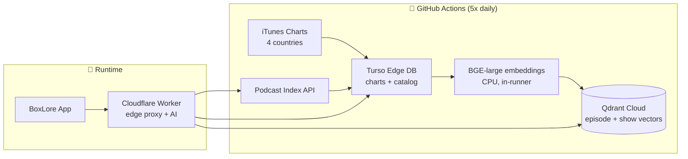

<div align="center">


# BoxLore

**A beautiful, intelligent podcast client for Android — 100% Jetpack Compose, Material 3 Expressive, and a semantic brain in the cloud.**

<br/>

<!-- Primary CTAs -->
<a href="https://play.google.com/store/apps/details?id=cx.aswin.boxlore">
  
</a>
&nbsp;&nbsp;
<a href="https://github.com/ashwkun/box.lore.android/releases/latest/download/app-release.apk">
  
</a>
&nbsp;&nbsp;
<a href="#-features">
  
</a>

<br/><br/>

<!-- Tech stack -->


<!-- Live repo stats -->
<br/>


<!-- Pipeline health -->
<br/>
<a href="https://github.com/ashwkun/box.lore.android/actions/workflows/sync-pi-data.yml"></a>
<a href="https://github.com/ashwkun/box.lore.android/actions/workflows/new-episode-check.yml"></a>
<a href="https://sonarcloud.io/summary/overall?id=ashwkun_box.lore.android"></a>

</div>

<br/>

> [!TIP]
> **New here?** Grab the app from [Google Play](https://play.google.com/store/apps/details?id=cx.aswin.boxlore), or jump to [How It Works](#%EF%B8%8F-how-it-works) to see the architecture behind the semantic search and recommendation engine.

---

## 📱 What is BoxLore?

BoxLore is an open-source podcast client that treats listening as a *discovery* experience, not just a play queue. It pairs a fully expressive Material 3 interface with a serverless intelligence layer: every trending show across 4 countries is embedded into a vector space nightly, so search understands *meaning* ("podcasts about the psychology of money") instead of just matching keywords.

**Why it stands out:**

- 🎨 **Living UI** — album artwork drives the entire color story. Dominant colors are extracted in real time (Palette API), saturation-boosted, and lightness-bounded for rich ambient gradients that never look muddy.
- 🧠 **Semantic everything** — search, recommendations, and "For You" feeds run on 1024-dim BGE embeddings served from Qdrant Cloud via Cloudflare edge workers.
- ⚡ **Obsessive performance** — deferred below-the-fold composition during tab slides, JankStats-audited scrolling, locked 60fps navigation.
- 🌍 **Multi-region charts** — trending feeds for 🇺🇸 US, 🇮🇳 India, 🇬🇧 UK, and 🇫🇷 France, refreshed daily by an autonomous GitHub Actions pipeline.

---

## ✨ Features

<div align="center">
<table>
  <tr>
    <td align="center" width="25%"><b>🚀 Onboarding</b><br/><sub>Pick interests & region</sub><br/><br/></td>
    <td align="center" width="25%"><b>🏠 Home Mixtapes</b><br/><sub>Time-aware curated queues</sub><br/><br/></td>
    <td align="center" width="25%"><b>📰 Daily Briefing</b><br/><sub>Your morning audio digest</sub><br/><br/></td>
    <td align="center" width="25%"><b>🃏 Curiosity Cards</b><br/><sub>Swipeable discovery deck</sub><br/><br/></td>
  </tr>
  <tr>
    <td align="center"><b>🔮 Semantic Search</b><br/><sub>Search by meaning, not words</sub><br/><br/></td>
    <td align="center"><b>🎯 For You</b><br/><sub>Taste-based recommendations</sub><br/><br/></td>
    <td align="center"><b>📚 Library</b><br/><sub>Subscriptions & smart downloads</sub><br/><br/></td>
    <td align="center"><b>🎧 Player</b><br/><sub>Ambient glow & live transcripts</sub><br/><br/></td>
  </tr>
</table>
</div>

<details>
<summary><b>🏠 &nbsp;Home & Discovery — the full list</b></summary>
<br/>

- **Mixtape queues** — dynamically curated listening sessions scored on your subscriptions, play history, and genres
- **Time-block curation** — morning briefings, evening deep-dives; the feed adapts to your clock
- **Curiosity card deck** — swipeable, ambient-colored discovery stack with pill controls
- **Dismissible new-episode banners** and granular completed-episode filtering
- **Trending charts** for US, India, UK, and France with localized badges

</details>

<details>
<summary><b>🎧 &nbsp;Player & Podcasting 2.0</b></summary>
<br/>

- **Dynamic ambient glow** — real-time HSL extraction from cover art feeds the player's background
- **Live transcripts** — synced reading with tap-to-seek on any line
- **Chapter notches** — clickable chapter markers directly on the seekbar
- **Video podcasts** — 16:9 orientation-locked layouts
- **Variable speed** 0.5x–3x with pitch correction, sleep timer, circular wavy buffering loader
- **Headphone gestures** — double-click mapped to +30s / −10s
- **MediaSession integration** — lockscreen, Android Auto-style controls, swipe-away protection during playback

</details>

<details>
<summary><b>🔍 &nbsp;Search, Recommendations & Intelligence</b></summary>
<br/>

- **Semantic search** — queries embedded at the edge (Cloudflare Workers AI), matched against 250K+ episode vectors in Qdrant
- **Edge spell-check** — real-time query correction before it ever hits the index
- **Hybrid retrieval** — instant SQLite FTS5 results layered under semantic hits
- **"For You" engine** — recommendations scored on played episodes, subscriptions, notification/auto-download signals, and genre affinity

</details>

<details>
<summary><b>⬇️ &nbsp;Library, Offline & Backup</b></summary>
<br/>

- **Smart downloads** — WorkManager-driven auto-download with automated background purging
- **Collapsible download sections** with multi-select batch operations
- **Full JSON backup/restore** — theme, region, and subscriptions restore reactively without an app restart
- **Persistent sort preferences** and continuation logic for serialized shows

</details>

---

## ⚙️ How It Works

The app is only half the story — a fully autonomous, zero-server data platform keeps the catalog fresh:



- **Staged pipeline** (`scripts/sync/01…07`) — charts refresh, catalog import, staleness-gated episode sync, budget-capped vectorization, grace-period cleanup, and per-day cost accounting, all logged with progress bars and cost footers in the Actions UI
- **Self-limiting** — every show holds exactly its latest 30 episodes in the vector index; embedding budgets keep each run bounded
- **Cost-aware** — the pipeline tracks its own Turso read/write spend daily against free-tier budgets and warns at 80% ([live report](data/db_cost_report.md))
- **Edge-served** — queries are embedded and answered from Cloudflare's network; the app never talks to a heavyweight backend

<details>
<summary><b>🛠️ &nbsp;Tech stack details</b></summary>
<br/>

| Layer | Technology |
| :--- | :--- |
| **UI** | Jetpack Compose, Material 3 Expressive, Coil, Palette API |
| **Architecture** | Multi-module Clean Architecture (`:core:*`, `:feature:*`), Coroutines + Flow |
| **Playback** | ExoPlayer (Media3), MediaSession, WorkManager |
| **Local data** | Room, SQLite FTS5, DataStore |
| **Edge & cloud** | Cloudflare Workers (TypeScript) + Workers AI, Turso (libSQL), Qdrant Cloud |
| **Embeddings** | BAAI bge-large-en-v1.5 (1024-dim), transformers.js in CI |
| **Data sources** | Podcast Index API, Apple Podcast Charts |
| **Quality** | SonarCloud, Qodo, Gitleaks, JankStats |

</details>

<details>
<summary><b>📦 &nbsp;Module map</b></summary>
<br/>

```
├── app/                  # entry point, navigation, DI graph
├── core/
│   ├── data/             # repositories, mappers, sync
│   ├── designsystem/     # theme, typography, shared composables
│   ├── model/            # pure Kotlin domain models
│   └── network/          # Podcast Index + edge proxy clients
├── feature/
│   ├── home/             # mixtapes, time blocks, charts
│   ├── explore/          # curiosity cards, semantic search, For You
│   ├── player/           # playback UI, transcripts, chapters
│   └── info/             # show & episode detail pages
├── proxy/                # Cloudflare Worker (edge AI + API proxy)
├── scripts/sync/         # autonomous data pipeline (01–07 + lib)
└── web/                  # share-link landing pages
```

</details>

---

## 🚀 Getting Started

**Just want the app?** → [Google Play](https://play.google.com/store/apps/details?id=cx.aswin.boxlore) or the [latest APK](https://github.com/ashwkun/box.lore.android/releases/latest/download/app-release.apk)

**Build it yourself:**

```bash
git clone https://github.com/ashwkun/box.lore.android.git
cd box.lore.android
./gradlew assembleDebug      # build
./gradlew installDebug       # install to a connected device
```

> [!NOTE]
> **Requirements:** Android Studio Ladybug+, Android SDK 35, JDK 17, Kotlin 1.9+. The app runs fully against public data sources out of the box — no API keys needed for a debug build.

---

## 🤝 Contributing

Contributions are very welcome — this project is a great playground for Compose, media, and vector-search experimentation.

| I want to… | Here's how |
| :--- | :--- |
| 🐛 Report a bug | [Open an issue](../../issues/new/choose) with repro steps |
| 💡 Suggest a feature | Start a thread in [Discussions](../../discussions) |
| 🔧 Submit code | Fork → branch → PR (SonarCloud + Qodo review every PR) |
| 📖 Read the guidelines | [CONTRIBUTING.md](CONTRIBUTING.md) |

---

## 📄 License

**GNU GPL v3** — use it, learn from it, fork it; derivatives stay open source. See [LICENSE](LICENSE).

---

<div align="center">

## ⭐ Star History

<a href="https://star-history.com/#ashwkun/box.lore.android&Date">
  
</a>

<br/><br/>

<a href="https://github.com/ashwkun/box.lore.android/graphs/contributors">
  
</a>

<br/><br/>

### Made with ❤️ and ☕ by a podcast fan

**If BoxLore made your commute better, [drop a ⭐](../../stargazers) — it genuinely helps.**

[⬆ Back to top](#boxlore)

</div>
