<div align="center" id="top">

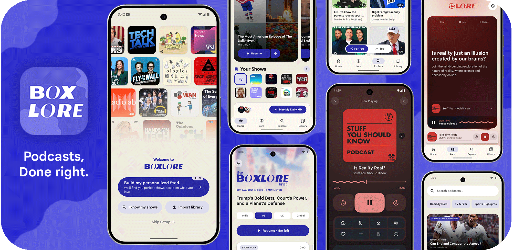

# boxlore

**Free Android podcast app & player**  
Semantic search · offline downloads · For You picks · no ads

<br/>

<a href="https://github.com/ashwkun/boxlore/releases/latest/download/boxlore-v0.0.8.apk">
  
</a>
&nbsp;&nbsp;
<a href="https://play.google.com/store/apps/details?id=cx.aswin.boxlore">
  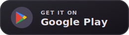
</a>

<br/><br/>

<a href="LICENSE"></a>


<br/><br/>

**[About](#about)** ·
**[Updates](#updates)** ·
**[Highlights](#highlights)** ·
**[Get started](#get-started)** ·
**[Gallery](#gallery)** ·
**[Install](#install)** ·
**[Developers](#developers)**


</div>

<!-- ========== 01 ABOUT ========== -->
<p align="center"></p>
<a id="about"></a>

<table>
<tr>
<td>

Most podcast apps feel the same: open API, keyword search, subscribe, Apple charts. Little personalization — unless you pay with ads or a subscription.

**boxlore** is a free Android podcast player that learns as you listen.

| | |
|:--|:--|
| **Find** | Natural-language / semantic search — describe what you want |
| **Play** | Stream or download episodes for offline listening |
| **Discover** | For You picks, curiosity cards, charts beyond title typing |
| **Own it** | Queue, OPML import/export, no ads, no paywall for the smart layer |

The smart index rebuilds daily and covers popular chart podcasts (growing over time). Outside that catalog, boxlore still works as a normal podcast client.

</td>
</tr>
</table>

<!-- ========== 02 RELEASE NOTES ========== -->
<p align="center">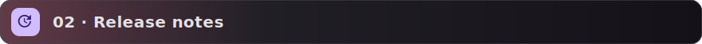</p>
<a id="updates"></a>

<!-- upcoming-changes:start -->
<div align="center">


<details>
<summary><b>🔮 Upcoming in the Next Release</b></summary>
<p align="left">
New features and improvements for the next release are currently in development.
</p>
<p align="left"><sub>AI-generated summary; may contain mistakes. Verify details in the <a href="CHANGELOG.md">changelog</a> and linked pull requests.</sub></p>
</details>

<br/>


<details open>
<summary><b>🎉 What's New (v0.0.8) - 2026-07-12</b></summary>
<p align="left">

<b>New features</b>
<ul align="left">
<li>Enhanced notifications with dry-run mode, admin UI, custom sounds, HTML preview, live validation, and saved templates. <a href="https://github.com/ashwkun/boxlore/pull/861"></a></li>
<li>Added option to set a custom label on category badges in announcements. <a href="https://github.com/ashwkun/boxlore/pull/862"></a></li>
<li>Added Android Auto support for browsing and actions, and fixed survey icons and low-contrast text issues. <a href="https://github.com/ashwkun/boxlore/pull/865"></a></li>
</ul>

<b>Improvements</b>
<ul align="left">
<li>Improved survey and announcement dialogs: scrolling for tall content, fixed contrast, corrected markdown lists. <a href="https://github.com/ashwkun/boxlore/pull/863"></a></li>
</ul>

<b>Fixes</b>
<ul align="left">
<li>Fixed artwork flicker while dragging the player sheet and refreshed next-episode arrow colors to Material 3. <a href="https://github.com/ashwkun/boxlore/pull/864"></a></li>
</ul>

</p>
<p align="left"><sub>AI-generated summary; may contain mistakes. Verify details in the <a href="CHANGELOG.md">changelog</a> and linked pull requests.</sub></p>
</details>

</div>
<!-- upcoming-changes:end -->

<!-- ========== 03 HIGHLIGHTS ========== -->
<p align="center"></p>
<a id="highlights"></a>
<a id="features"></a>

<table>
  <tr>
    <td width="50%" valign="top" align="center">
      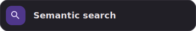<br/>
      <p align="left">Search episodes by <em>meaning</em>, not exact keywords.<br/>
      <em>"stories about startup failure"</em> → relevant episodes.</p>
    </td>
    <td width="50%" valign="top" align="center">
      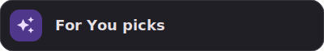<br/>
      <p align="left">Personalized picks on Home and Explore from listening, genres, and subs.<br/>
      <strong>Because You Like</strong> rows tied to a favorite show.</p>
    </td>
  </tr>
  <tr>
    <td width="50%" valign="top" align="center">
      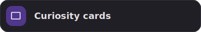<br/>
      <p align="left">Swipe question cards on Learn to find episodes you would not search for.<br/>
      Right to queue · left to dismiss · tap to play.</p>
    </td>
    <td width="50%" valign="top" align="center">
      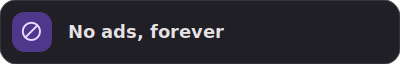<br/>
      <p align="left">No banners, no sponsored inserts, no premium tier to unlock search or recommendations.</p>
    </td>
  </tr>
</table>

<!-- ========== 04 GET STARTED ========== -->
<p align="center"></p>
<a id="get-started"></a>
<a id="first-launch"></a>

<p align="center">Pick the path that matches how you already listen.</p>

<table>
  <tr>
    <td width="33%" valign="top" align="center">
      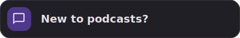<br/>
      <p align="left"><strong>AI onboarding</strong> (default) — short chat about preferences → semantic matches → personalized feed to subscribe before you enter the app.</p>
    </td>
    <td width="33%" valign="top" align="center">
      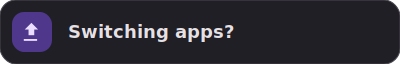<br/>
      <p align="left"><strong>Import library</strong> — Pocket Casts, Apple Podcasts, AntennaPod, or any <strong>OPML</strong> export, plus similar-show recommendations.</p>
      <p align="left"><sub>Export anytime: Profile → Backup &amp; Restore.</sub></p>
    </td>
    <td width="33%" valign="top" align="center">
      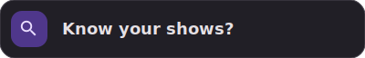<br/>
      <p align="left"><strong>I know my shows</strong> — search during setup, subscribe manually, optional similar-show suggestions, or <strong>Skip Setup</strong>.</p>
    </td>
  </tr>
</table>

<!-- ========== 05 MORE FEATURES ========== -->
<p align="center"></p>

<table>
<tr><td>

<details>
<summary> <b>Listening &amp; playback</b></summary>
<br/>

| Feature | What you get |
|:--|:--|
| **Mixtapes** | Home queue of up to 15 scored episodes from subscriptions |
| **Player** | Mini + full player, queue, 0.5×–1.5× speed, sleep timer, transcripts, chapters, video, Android Auto |
| **Podcasting 2.0** | Native chapters/transcripts when provided; AI fallback (beta, daily limit) |

</details>

<details>
<summary> <b>Library &amp; offline</b></summary>
<br/>

| Feature | What you get |
|:--|:--|
| **Library** | Subscriptions, downloads, history, likes — offline opens downloads |
| **Backup** | OPML (any podcast app) or full JSON (boxlore state) |

</details>

<details>
<summary> <b>Smart automation</b></summary>
<br/>

| Feature | What you get |
|:--|:--|
| **Daily briefing** | Optional region AI news audio + script |
| **Smart Downloads** | App-wide curated offline pool (off by default) |
| **Auto-download** | Per-podcast new-episode downloads (off by default) |
| **Notifications** | Per-podcast bell (off by default) |
| **Design** | Material 3 / Material You, shimmer, fast artwork |

</details>

</td></tr>
</table>

<!-- ========== 06 GALLERY ========== -->
<p align="center"></p>
<a id="gallery"></a>
<a id="screenshots"></a>

<div align="center">
<table>
  <tr>
    <td align="center" width="25%">
      <br/><br/>
      
    </td>
    <td align="center" width="25%">
      <br/><br/>
      
    </td>
    <td align="center" width="25%">
      <br/><br/>
      
    </td>
    <td align="center" width="25%">
      <br/><br/>
      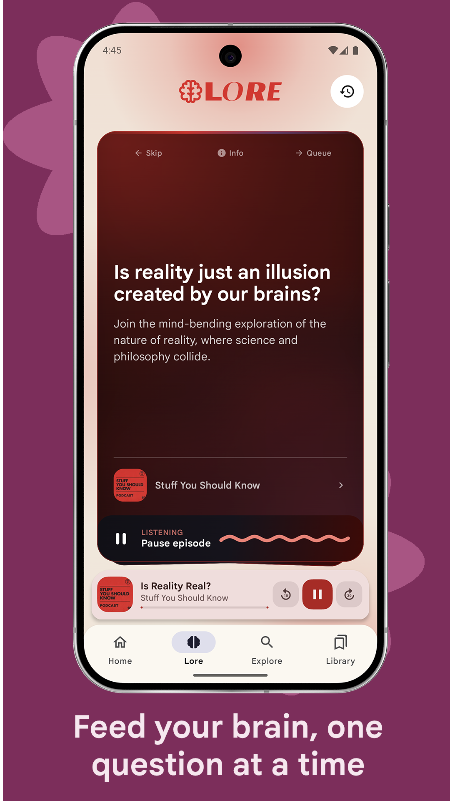
    </td>
  </tr>
  <tr>
    <td align="center">
      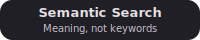<br/><br/>
      
    </td>
    <td align="center">
      <br/><br/>
      
    </td>
    <td align="center">
      <br/><br/>
      
    </td>
    <td align="center">
      <br/><br/>
      
    </td>
  </tr>
</table>
</div>

<!-- ========== 07 INSTALL ========== -->
<p align="center"></p>
<a id="install"></a>
<a id="install--build"></a>

<div align="center">
  <a href="https://github.com/ashwkun/boxlore/releases/latest/download/boxlore-v0.0.8.apk">
    
  </a>
  &nbsp;&nbsp;
  <a href="https://play.google.com/store/apps/details?id=cx.aswin.boxlore">
    
  </a>
</div>

<br/>

<table>
<tr><td>

**Sideload** — enable *Install from unknown sources*, then install the APK.

**Build from source**

```bash
git clone https://github.com/ashwkun/boxlore.git
cd boxlore
./gradlew assembleDebug
./gradlew installDebug
```

| Requirement | Version |
|:--|:--|
| Android Studio | Ladybug+ |
| Android SDK | 35+ |
| JDK | 17 |
| Kotlin | 1.9+ |

</td></tr>
</table>

<!-- ========== 08 DEVELOPERS ========== -->
<p align="center">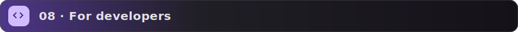</p>
<a id="developers"></a>

<details id="for-developers">
<summary> <b>Codebase &amp; stack</b></summary>
<br/>

**Modules**

| Module | Role |
|:--|:--|
| `:core:data` | Repositories, mappers |
| `:core:designsystem` | Themes, shared composables |
| `:core:model` | Domain models |
| `:core:network` | Podcast Index + edge proxy |
| `:feature:explore` | Search, For You, curiosity cards |
| `:feature:home` | Mixtape, charts, briefing |
| `:feature:player` | Playback UI |
| `:feature:briefing` | Daily briefing screen |
| `:feature:library` | Downloads, subs, history |
| `:feature:info` | Podcast & episode detail |

**Stack**

| Technology | Purpose |
|:--|:--|
| Kotlin | App language |
| Jetpack Compose | UI (Material 3) |
| Coroutines & Flow | Async / state |
| Retrofit 2 | REST |
| Room | Local DB |
| ExoPlayer (Media3) | Audio / video |
| Coil | Images |
| Cloudflare Workers | Search & recommendations edge |
| bge-m3 | Semantic embeddings (1024-dim) |

**Data**

| Source | Data |
|:--|:--|
| Podcast Index API | Catalog, keyword search |
| Apple Podcast Charts | Daily trending (US, IN, GB, FR) |

</details>

<!-- ========== 09 COMMUNITY ========== -->
<p align="center"></p>

<table>
  <tr>
    <td width="50%" valign="top">

**Contributing**

1. [Report a bug](https://github.com/ashwkun/boxlore/issues)
2. [Suggest a feature](https://github.com/ashwkun/boxlore/discussions)
3. Fork → PR

**License**

Proprietary — All Rights Reserved.  
See [LICENSE](LICENSE).

    </td>
    <td width="50%" valign="top" align="center">

**Contributors**

<a href="https://github.com/ashwkun/boxlore/graphs/contributors">
  
</a>

    </td>
  </tr>
</table>

<br/>

<div align="center">


Built by someone who listens to too many podcasts.

**[Back to top](#top)**

</div>
