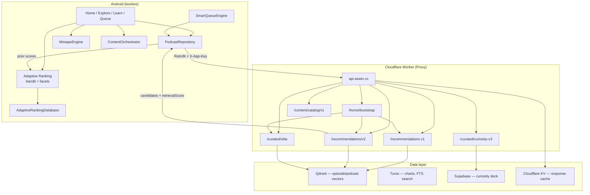

# boxlore Recommendation & Personalization System

> How boxlore decides what to show you, and how it learns from what you do.

This document is a deep, implementation-accurate walkthrough of boxlore's recommendation
engine across **both repositories**:

| Repo | Role |
|------|------|
| [`ashwkun/boxlore`](https://github.com/ashwkun/boxlore) | Android client — on-device learning, surface orchestration, queue/mixtape logic |
| [`ashwkun/Proxy`](https://github.com/ashwkun/Proxy) | Cloudflare Worker (`api.aswin.cx`) — semantic retrieval, vector search, curated content |

It covers the on-device machine-learning models, the server-side retrieval pipelines,
the full retrieval → ranking → diversification → layout stack, the reward/feedback loop
that makes the app "learn", how every user surface plugs into the system, and the
client–server contract between them.

**Division of labor:** the proxy is **stateless** — it turns seeds and filters into
semantically relevant *candidates*. The Android client is **stateful** — it maintains
the personalization model, records exposures, and re-ranks every candidate list on-device.
There is no cloud user-profile store; the learned model lives in a local Room database
and is only ever uploaded as part of an opt-in encrypted backup.

---

## 1. TL;DR / mental model

boxlore personalizes in two complementary ways:

1. **A per-objective contextual bandit** (`AdaptiveLinearModel`) — a small online
   linear model (LinUCB-style ridge regression with an optional exploration bonus) that
   learns *how much each signal matters to you*. It takes an 18-dimensional feature
   vector describing a candidate episode/podcast and produces a "learned" score, which is
   blended with a hand-tuned prior score.

2. **Bayesian preference facets** (`BayesianPreferenceFacet`) — per-show, per-genre and
   per-source "taste meters" that accumulate positive/negative evidence with time-decay
   and produce an affinity in `[-1, 1]`. These affinities are themselves *features* fed
   into the bandit, so the two systems compose.

The learning loop is:

```
show item  ──▶  record EXPOSURE (feature vector snapshot, unresolved)
                         │
user acts (play/like/subscribe/skip/queue/download/dismiss…)
                         │
                         ▼
             compute REWARD  ∈ [-1, 1]
                         │
        ┌────────────────┴─────────────────┐
        ▼                                   ▼
  update bandit model              update preference facets
  (resolve the exposure)           (SHOW / GENRE / SOURCE)
```

Because the exposure captured the exact feature vector the item was shown with, the model
learns from the *state at the moment of the decision*, not a reconstructed one.

Key source packages:

- `core/data/.../ranking/` — the ML core (bandit, facets, reward, features, persistence).
- `core/data/.../content/` — the retrieval→ranking→layout orchestration used by Home.
- `core/data/MixtapeEngine.kt`, `core/data/SmartQueueEngine.kt` — surface-specific engines.
- `core/network/.../BoxLoreApi.kt` — the boundary to the server (candidate retrieval,
  semantic search). The server implementation lives in the `proxy` repo
  (`proxy/src/routes/`).

---

## 2. Architecture at a glance

### 2.1 Full-stack view



### 2.2 On-device pipeline

```
        ┌──────────────────────────── RETRIEVAL (candidates) ─────────────────────────────┐
        │  Subscriptions   Listening history   Server recs   Semantic search   Trending    │
        │  (SUBSCRIPTION)  (LOCAL_HISTORY)      (SERVER_REC/  (CURATED_INTENT)  (TRENDING)  │
        │                                        CURATED)                        Liked/DL   │
        └───────────────────────────────────────┬──────────────────────────────────────────┘
                                                 │ each candidate carries a `retrievalScore`
                                                 ▼
        ┌──────────────────────────── SCORING (per objective) ────────────────────────────┐
        │  1. Legacy/prior score  → normalizePriors() → [0,1]                              │
        │  2. Build 18-dim feature vector (incl. Bayesian facet affinities)               │
        │  3. AdaptiveLinearModel.score(): final = (1-b)·prior + b·tanh(θ·x) + explore     │
        └───────────────────────────────────────┬──────────────────────────────────────────┘
                                                 ▼
        ┌──────────────────────────── DIVERSIFICATION ────────────────────────────────────┐
        │  DiversityReranker: max-per-show cap, genre-repeat penalty, recent-show penalty, │
        │  reserved "novel" slot, de-duplication.                                          │
        └───────────────────────────────────────┬──────────────────────────────────────────┘
                                                 ▼
        ┌──────────────────────────── LAYOUT (Home only) ─────────────────────────────────┐
        │  SlateComposer: group into sections per "intent", enforce cross-section          │
        │  de-dup + per-show caps, keep "protected" sections, order optional sections by   │
        │  utility, cache per session/daypart/day.                                         │
        └───────────────────────────────────────┬──────────────────────────────────────────┘
                                                 ▼
                                        Rendered UI + exposure logging
                                                 │
                                                 ▼  (user interacts)
        ┌──────────────────────────── FEEDBACK / LEARNING ────────────────────────────────┐
        │  RankingFeedbackRepository → RankingReward → AdaptiveRankingRepository:          │
        │  resolve exposure + model.update() + facet.update()                              │
        └──────────────────────────────────────────────────────────────────────────────────┘
```

---

## 3. The learned model — `AdaptiveLinearModel`

File: `core/data/.../ranking/AdaptiveLinearModel.kt`

This is a **regularized online linear model with optional upper-confidence-bound
exploration** — essentially a per-objective LinUCB / Bayesian ridge regression bandit.

### 3.1 State (`AdaptiveModelState`)

Each objective owns one state:

| Field | Meaning |
|-------|---------|
| `covariance` (`A`) | `d×d` matrix, initialized to `RIDGE · I` (ridge = `1.0`). Accumulates `Σ xxᵀ`. |
| `inverseCovariance` (`A⁻¹`) | Cached inverse of `A`, recomputed on every update via Gauss-Jordan elimination. |
| `rewardVector` (`b`) | Length-`d` vector accumulating `Σ x · reward`. |
| `updateCount` | Number of resolved outcomes folded into the model. |
| `featureSchemaVersion` / `dimension` | Guards against schema drift (`dimension = 18`). |

The learned weight vector is derived on demand: **`θ = A⁻¹ · b`**.

### 3.2 Scoring

```
rawLearned  = θ · x                       // linear response
learned     = tanh(rawLearned)            // squash to (-1, 1)
uncertainty = α · sqrt(xᵀ A⁻¹ x)          // exploration bonus (α = 0.15)
blend       = min(updateCount/50, 1) · 0.65
final       = clamp( (1-blend)·prior + blend·learned + uncertainty , -1, 1)
```

- **`prior`** is the hand-tuned/server score, clamped to `[-1, 1]`.
- **`blend`** ramps the learned model in *gradually*: at 0 outcomes it is `0` (pure
  prior); at ≥50 outcomes it saturates at `maximumLearnedBlend = 0.65`. The model never
  fully overrides the prior — the prior always keeps ≥35% weight.
- **`uncertainty`** (the UCB term) is only added when the objective
  `allowsExploration` **and** `updateCount ≥ explorationThreshold (50)`. It is larger for
  feature combinations the model has seen little of, nudging exploratory items up.
- `contributions` is a lazily-computed per-feature breakdown (`θᵢ · xᵢ`) used for
  debugging/telemetry, not for scoring.

### 3.3 Learning (`update`)

On each resolved outcome with bounded `reward ∈ [-1, 1]`:

```
A ← forgetting·A  +  (1-forgetting)·RIDGE·I(diagonal)  +  x·xᵀ
b ← forgetting·b  +  x·reward
A⁻¹ ← invert(A)
updateCount += 1
```

- **`forgettingFactor = 0.995`** implements *exponential forgetting*: old evidence slowly
  decays so the model tracks changing taste rather than averaging your entire history
  forever. The ridge term is continuously "refreshed" on the diagonal so `A` stays
  well-conditioned (invertible) even as older `xxᵀ` mass decays.
- The inverse is recomputed exactly each time (the feature dimension is small, `d=18`, so
  a full Gauss-Jordan inversion with partial pivoting is cheap). A singular matrix throws,
  which is guarded against by the ridge refresh.

### 3.4 Why this design

- **Interpretable & tiny.** 18 features, one small matrix per objective — trivial to run
  on-device, and `contributions` makes decisions explainable.
- **Cold-start safe.** New users get the curated prior; the learned model earns influence
  only as evidence accrues (`blend`).
- **Exploration without wrecking the feed.** UCB exploration is opt-in per objective and
  only kicks in after the learning threshold, and even then is a bounded additive nudge.
- **Non-stationary.** Forgetting keeps it responsive to changing tastes.

Tests that pin this behavior: `AdaptiveRankingTest`
(`cold start uses legacy prior and grows learned influence gradually`,
`offline objective never explores`,
`matrix update learns opposite outcomes in opposite directions`).

---

## 4. The taste model — `BayesianPreferenceFacet`

File: `core/data/.../ranking/BayesianPreferenceFacet.kt`

While the bandit learns *how signals combine*, facets track *which specific shows/genres/
sources you like*. There is one facet per key, of type:

`SHOW`, `GENRE`, `SOURCE`, `DURATION_BUCKET`, `TIME_CONTEXT`, `INTENT` (`PreferenceFacetType`).

Each facet is a Beta-style counter of `positiveEvidence` / `negativeEvidence`:

- **Update:** positive reward adds to `positiveEvidence`, negative to `negativeEvidence`
  (`update()` splits a `[-1,1]` reward into the two buckets).
- **Time decay:** before every read/update, evidence is decayed with a **90-day
  half-life** (`decayed()`, `factor = 2^(-elapsed/halfLife)`). Stale preferences fade
  toward neutral.
- **Affinity** (`affinity()`): with a symmetric prior (`priorStrength = 2.0`):

  ```
  α = prior/2 + positiveEvidence
  β = prior/2 + negativeEvidence
  posterior = α / (α + β)              // Beta mean, in (0,1)
  affinity  = clamp((posterior - 0.5)·2, -1, 1)
  ```

  So with no evidence, affinity = 0 (neutral); consistent likes push toward `+1`,
  consistent skips/removals toward `-1`, and the prior keeps early estimates conservative.

These affinities are mapped from `[-1,1]` into `[0,1]` (`toUnitAffinity`) and injected into
the bandit feature vector as `SHOW_AFFINITY`, `GENRE_AFFINITY`, `SOURCE_AFFINITY`. This is
the mechanism by which "I keep liking this show" becomes a ranking signal that also
generalizes (via genre/source) to shows you've never heard.

Test: `bayesian facets decay toward neutral and learn both signs`.

---

## 5. The feature vector (18 dimensions)

Files: `RankingModels.kt` (`FeatureSlot`, `CandidateSignals`, `CandidateFeatureBuilder`),
consumed by `AdaptiveCandidateScorer.kt`.

The **slot order is a persisted contract** (schema `VERSION = 1`, `dimension = 18`) — it
must never be reordered, because stored covariance matrices are indexed by ordinal. The
test `feature schema preserves exact persisted slot order` locks it.

| # | Slot | Source signal | Transform |
|---|------|---------------|-----------|
| 0 | `INTERCEPT` | — | constant `1.0` (bias term) |
| 1 | `SHOW_AFFINITY` | `SHOW` facet affinity | mapped to `[0,1]` |
| 2 | `GENRE_AFFINITY` | avg `GENRE` facet affinities | `[0,1]` |
| 3 | `SOURCE_AFFINITY` | `SOURCE` facet affinity | `[0,1]` |
| 4 | `FRESHNESS` | episode age | `exp(-ageHours / (24·14))` → 14-day time constant |
| 5 | `NOVELTY` | is an unseen/unsubscribed show | `0/1` |
| 6 | `DURATION_FIT` | episode length vs. ~45 min ideal | `[0,1]` triangle around 45 min |
| 7 | `SUBSCRIBED` | user subscribes | `0/1` |
| 8 | `RESUME_PROGRESS` | fraction already listened | `[0,1]` |
| 9 | `UNPLAYED` | never started & not completed | `0/1` |
| 10 | `SERIAL_MATCH` | serial vs. episodic fit | `[0,1]` |
| 11 | `SERVER_RELEVANCE` | normalized retrieval/prior score | `[0,1]` |
| 12 | `EXPOSURE_FATIGUE` | times recently shown | `-(1 - exp(-count/3))` (negative) |
| 13 | `TIME_CONTEXT` | daypart match | `[0,1]` |
| 14 | `OFFLINE_SUITABILITY` | fit for offline/downloaded listening | `[0,1]` |
| 15 | `EXPLICIT_PREFERENCE` | auto-download (1.0) / notifications (0.7) | `[-1,1]` |
| 16 | `RECENT_SUBSCRIPTION` | recency of subscribing | `exp(-hours / (24·14))` |
| 17 | `CURRENT_SHOW` | is the currently playing show | `0/1` |

`CandidateFeatureBuilder.build()` clamps every value to be finite and bounded, so a
malformed signal can never poison the matrix. Test: `feature builder returns finite
bounded schema`.

---

## 6. The reward model — turning behavior into a number

File: `core/data/.../ranking/RankingReward.kt`

Every learnable interaction is converted to a scalar reward in `[-1, 1]`.

### 6.1 Action weights (`RankingAction`)

| Action | Weight | | Action | Weight |
|--------|-------:|-|--------|-------:|
| `SUBSCRIBE` | +0.80 | | `EARLY_SKIP` | −0.70 |
| `LIKE` | +0.65 | | `UNSUBSCRIBE` | −0.70 |
| `EXPLICIT_QUEUE` | +0.55 | | `REMOVE_AUTOFILLED` | −0.80 |
| `MANUAL_DOWNLOAD` | +0.55 | | `DISMISS` | −0.75 |
| `COMPLETE` | +0.35 | | `UNLIKE` | −0.50 |
| `MOVE_UP` | +0.25 | | `MOVE_DOWN` | −0.25 |
| `MEANINGFUL_PLAY` | +0.22 | | | |
| `OPEN_DETAILS` | +0.08 | | | |

### 6.2 Listening value

Added on top of action weights when playback happened:

```
absolute = (ln(1 + min(listenSeconds, 3600)) / ln(3601)) · 0.2   // rewards absolute time, saturating at 1h
progress = clamp(listenSeconds / durationSeconds, 0, 1) · 0.2     // rewards finishing
reward   = clamp(Σ actionWeights + absolute + progress, -1, 1)
```

So a full listen of a liked, newly-subscribed show approaches the `+1` ceiling; an early
skip plus removing an auto-filled item approaches `−1`. Test: `reward is bounded and
ignored exposure has no penalty` (note: an item that was merely *shown* but not acted on
yields reward `0`, not a penalty — absence of engagement is neutral, not negative).

### 6.3 What "meaningful play" means

`RankingFeedbackRepository`: playback counts as `MEANINGFUL_PLAY` when the user listens
≥ 60s **or** ≥ 20% of the episode. `EARLY_SKIP` and `COMPLETE` are derived from the
playback service. A 5-second per-(episode, action) dedup window prevents double-counting.

---

## 7. The learning loop end-to-end

### 7.1 Exposure (the decision snapshot)

When an item is actually shown, the surface calls
`RankingFeedbackRepository.recordExposure(...)`, which persists a `RankingExposureEntity`
containing the **exact feature vector**, objective, surface, source, and timestamp, with
`resolvedAt = null`. Example call site: `HomeViewModel` logs exposures for newly-visible
Home slate items; `LearnViewModel` logs an exposure for each curiosity card shown.

Exposures are pruned aggressively (see §10): 30-day retention, max 1000 rows.

### 7.2 Resolution (the outcome)

When the user acts, one of these fires:

- `recordAction(target, action, …)` — discrete actions (like, subscribe, queue,
  download, move, remove, dismiss, open-details).
- `recordPlayback(target, listenSeconds, durationSeconds, completed, earlySkip)` — from
  the playback service (`BoxLorePlaybackService`).

Both:

1. Compute the reward (`RankingReward.calculate`).
2. **Update the preference facets** for the item's SHOW (always), GENRE and SOURCE
   (`updateTasteFacets`).
3. For *terminal* actions (play/like/subscribe/queue/download/skip/remove/move/dismiss),
   **resolve the latest unresolved exposure** for that episode
   (`AdaptiveRankingRepository.resolveLatestExposure`), which loads the stored feature
   vector and calls `AdaptiveLinearModel.update()` for that exposure's objective.

If no exposure was recorded (e.g. the user found the episode via search rather than a
ranked surface), the facets still learn even though the bandit doesn't — so taste signal
is never lost.

### 7.3 Where signals originate (call-site map)

| Signal | Emitted from |
|--------|--------------|
| `EXPLICIT_QUEUE` | `PlaybackRepository.addToQueue`, `QueueRepository` (manual/Lore queue adds) |
| `REMOVE_AUTOFILLED` | `PlaybackRepository` (removing an auto-filled queue item) |
| `MOVE_UP` / `MOVE_DOWN` | `PlaybackRepository` (reordering the queue) |
| `LIKE` / `UNLIKE` | `PlaybackRepository.toggleLike` |
| `SUBSCRIBE` / `UNSUBSCRIBE` | `SubscriptionRepository` |
| `MANUAL_DOWNLOAD` | `DownloadRepository` (only non-smart downloads) |
| `MEANINGFUL_PLAY` / `COMPLETE` / `EARLY_SKIP` | `BoxLorePlaybackService.recordPlayback` |
| `OPEN_DETAILS` / `DISMISS` | `LearnViewModel` (curiosity cards) |

---

## 8. Retrieval → ranking → diversification → layout

### 8.1 Candidate sources (`CandidateSource`)

`SUBSCRIPTION`, `LOCAL_HISTORY`, `SERVER_RECOMMENDATION`, `CURATED_INTENT`, `TRENDING`,
`LIKED`, `DOWNLOADED`. Providers wrap these into `ContentCandidate`s with a
`retrievalScore` (server-supplied `retrievalScore`/`semanticScore`, or reciprocal-rank
`1/(index+1)` when the source is just an ordered list).

### 8.2 Scoring (`AdaptiveCandidateScorer`)

File: `core/data/.../ranking/AdaptiveCandidateScorer.kt`.

- `scorePodcasts` / `scoreEpisodes` build features (pulling facet affinities in a single
  batched DB read via `facetAffinities`), then call the bandit's `scoreBatch` for the
  objective.
- Priors are normalized with `normalizePriors` — a log1p normalization
  (`ln(1+v)/ln(1+max)`) that squashes heavy-tailed server scores into `[0,1]` so they sit
  in the same range as the learned score before blending.
- If adaptive ranking is disabled for the (objective, surface) pair, it **transparently
  falls back to the normalized prior order** (and, for `scorePodcasts`, the legacy
  `PodcastScoring` output). Nothing breaks; you just get the non-personalized ranking.

### 8.3 The prior — `PodcastScoring`

File: `core/data/PodcastScoring.kt`. A transparent, hand-tuned heuristic scoring
subscriptions by play count, like count, play recency, freshness of the latest unplayed
episode, subscription recency, and notification/auto-download boosts. This is the "prior"
the bandit blends against and the cold-start behavior.

### 8.4 Diversification (`DiversityReranker`)

File: `RankingModels.kt`. Greedy re-ranking under a `DiversityPolicy`:

- de-duplicates by episode,
- caps items per show (`maxPerShow`),
- applies a `genreRepeatPenalty` per repeated genre and a `recentShowPenalty` for shows
  played recently,
- can **reserve a slot for a "novel"** (unsubscribed/unseen) candidate, even evicting the
  weakest pick to guarantee discovery.

Tests: `diversity reranker removes duplicates caps shows and reserves novelty`,
`novel candidate can replace capped item from the same show`.

### 8.5 Layout / slate composition (Home) — `ContentOrchestrator`

Files: `core/data/.../content/*`.

The Home feed is assembled by the `ContentOrchestrator`:

1. **Intent resolution** (`ContentIntentResolver`) — a server-delivered
   `ContentCatalogSnapshot` (endpoint `/content/catalog/v1`) defines "intents" (rows) with
   objectives, eligible surfaces/dayparts, layouts, item counts and refresh policies. If
   the catalog is missing/expired/unsupported, it falls back to an embedded
   `anytimeFallback` intent so the feed always renders.
2. **Per-intent retrieval + ranking** run concurrently (`supervisorScope`), each producing
   a ranked candidate list via `AdaptiveContentCandidateRanker` (which delegates to
   `AdaptiveCandidateScorer`). Provider failures are isolated (one dead source can't blank
   the feed); ranker failure falls back to retrieval order.
3. **Slate composition** (`SlateComposer`):
   - respects a `SharedExposureBudget` so the same item/show doesn't repeat across rows,
   - keeps `protected` sections first, orders the rest by a `utility` score
     (top-item quality 70% + novelty 20% + online/offline fit 10%),
   - enforces cross-section de-dup and a global per-show cap,
   - drops sections that fall below their `minimumItems`.
4. **Caching**: slates are cached per session, keyed by a fingerprint that honors each
   intent's `refreshPolicy` (`SESSION` / `MANUAL` / `DAYPART` / `DAILY`) — e.g. a `DAILY`
   row is reused within a day and regenerated the next.

Tests: `ContentOrchestratorTest` covers fallback, provider isolation, protected/dedup,
ranker-failure fallback, cancellation safety, and daily-refresh invalidation.

---

## 9. Objectives, surfaces, and rollout controls

### 9.1 Objectives (`RankingObjective`) — one model each

| Objective | Explores? | Used for |
|-----------|:--------:|----------|
| `YOUR_SHOWS` | no | Ranking your subscriptions (Mixtape/Home "your shows") |
| `DISCOVERY` | yes | For You, Explore search, trending, recommendations |
| `CONTINUATION` | yes | Mixtape ordering, Smart Queue fallback refills |
| `OFFLINE` | no | Downloads ordering |
| `SLATE` | yes | Generic slate composition |

Separate models mean "what makes a good next-in-queue pick" is learned independently from
"what makes a good discovery pick".

### 9.2 Surfaces (`RankingSurface`)

`HOME`, `EXPLORE`, `LIBRARY`, `QUEUE`, `DOWNLOADS`, `ANDROID_AUTO`.

### 9.3 Runtime gating (`RankingRuntimeControls`)

Adaptive ranking is enabled only when **all** of: the global toggle (default on), the
per-objective toggle (default on), and the per-surface toggle are true. The per-surface
default comes from `RankingRolloutPolicy`, which **enables only `HOME` by default** — so
out of the box, the learned model actively re-ranks Home, while other surfaces compute
features/priors but return the prior order until explicitly enabled. Test: `adaptive
rollout starts on home only`. All toggles are stored in `SharedPreferences` and can be
flipped (e.g. via debug/settings) without touching the model state.

---

## 10. Persistence, backup, pruning, reset

Files: `ranking/database/*`, `RankingSerialization.kt`, `AdaptiveRankingRepository.kt`.

- **Room DB** (`AdaptiveRankingDatabase`) with three tables:
  `adaptive_models` (one row per objective), `preference_facets` (one row per
  type+key), `ranking_exposures` (decision log).
- `DoubleArray`s (covariance, inverse, reward vector, feature vectors) are stored as
  little-endian `ByteArray` blobs (`RankingSerialization`) — exact round-trip, no precision
  loss. Test: `serialization preserves doubles exactly`.
- **Exposure hygiene:** pruned to a 30-day retention window and a hard cap of 1000 rows,
  re-checked every 25 inserts.
- **Concurrency:** all model reads/writes for an objective are serialized behind a
  per-objective `Mutex`, so scoring and updates never race on the matrix.
- **Backup/restore:** `exportBackup` / `restoreBackup` (version-checked, fully validated —
  finite doubles, known enums, size caps) let the learned personalization travel with the
  user's OPML/JSON backup (`Profile → Backup & Restore`). Test: `adaptive learning backup
  survives json round trip`.
- **Reset:** `RankingFeedbackRepository.reset()` (surfaced in Settings, e.g.
  `ResetAnalyticsDialog`) clears all models, facets, exposures and shadow diagnostics —
  a true "forget me" for recommendations.

---

## 11. Where it shows up in the app (surface by surface)

| Surface | Client engine | Server endpoints | Objective |
|---------|---------------|------------------|-----------|
| Home — For You | `ContentOrchestrator` + `AdaptiveCandidateScorer` | `/home/bootstrap`, `/recommendations/v2`, `/content/catalog/v1` | `DISCOVERY` |
| Home — Mixtape | `MixtapeEngine` | `/recommendations/v2` (fallback if <3 local candidates) | `CONTINUATION` |
| Home — Because You Like | `BecauseYouLikeSection` | `/recommendations/because-you-like` | `DISCOVERY` |
| Home — Trending / vibes | `HomeViewModel` | `/trending`, `/curated/vibe` | `DISCOVERY` |
| Explore — For You tab | `ExploreViewModel` | `/recommendations/v2` | `DISCOVERY` |
| Explore — search | `ExploreViewModel` | `/search/semantic` | `DISCOVERY` |
| Learn — curiosity | `LearnViewModel` | `/curated/curiosity-v3` | `DISCOVERY` |
| Smart Queue | `DefaultSmartQueueEngine` | `/recommendations/v2`, `/episodes/similar`, `/trending` | `CONTINUATION` |
| Downloads | `SmartDownloadManager` | `/recommendations/v2` + `MixtapeEngine` | `OFFLINE` |
| Episode info | `EpisodeInfoViewModel` | `/episodes/similar` | — |
| Android Auto | `BoxLorePlaybackService` | same as Smart Queue + Mixtape prewarm | `CONTINUATION` |

Details:

- **Home — "For You" / Mixtape.** `HomeViewModel` wires a `ContentOrchestrator` (server
  intent + subscription providers, `AdaptiveContentCandidateRanker`) for the For You rows,
  ranks trending and server recommendations with `DISCOVERY`, ranks subscriptions with
  `YOUR_SHOWS`, then hands everything to `MixtapeEngine.build(...)` which produces the
  home queue. `MixtapeEngine` first builds resume + unplayed candidates with a transparent
  freshness/affinity heuristic, then (when an `AdaptiveRanking` is supplied) re-scores them
  with the `CONTINUATION` model before taking the top 15.
- **Explore — search.** `ExploreViewModel` re-ranks search results in tie-windows with
  the `DISCOVERY`/`EXPLORE` model (`rankPodcasts` / `scoreEpisodes`), so results that match
  your taste float up within each relevance band.
- **Learn — curiosity cards.** `LearnViewModel` records an exposure per card, then
  `OPEN_DETAILS` (tap/queue/play) or `DISMISS` (swipe-away after meaningful dwell) as
  feedback — this is the clearest "swipe to teach" loop.
- **Smart Queue.** `DefaultSmartQueueEngine` is a tiered, offline-first refill engine
  (same-show continuation → resume → subscriptions → network recs/similar → liked-similar
  → trending). Its fallback tiers are re-ranked by the `CONTINUATION`/`QUEUE` model with a
  diversity policy that reserves a novel slot. A `QueueSkipMemory` down-ranks shows you
  keep skipping.
- **Because You Like.** `BecauseYouLikeSection` / `ChangeRecommendationPodcastSheet` use
  the server `recommendations/because-you-like` endpoint seeded by a show you like.
- **Downloads / Smart Downloads.** Use the `OFFLINE` objective (no exploration) and
  `DOWNLOADED`/`LIKED` sources.

---

## 12. Server-side retrieval (the `proxy` repo)

The **retrieval and semantic layer runs server-side** in the [`proxy`](https://github.com/ashwkun/Proxy)
repository — a Cloudflare Worker deployed at `api.aswin.cx` (`wrangler.jsonc` → worker
`boxcast-api`). The Android client talks to it via `BoxLoreApi` (`core/network/.../BoxLoreApi.kt`).
**Ranking and learning happen on the client**, on top of whatever candidates the server returns.

### 12.1 Proxy architecture

```
Android app
    │  HTTPS + X-App-Key + X-Device-UUID [+ X-Firebase-AppCheck]
    ▼
proxy/src/index.ts  (router)
    ├── routes/recommendations.ts      POST /recommendations, /recommendations/because-you-like
    ├── routes/recommendationsV2.ts    POST /recommendations/v2
    ├── routes/bootstrap.ts            GET/POST /home/bootstrap
    ├── routes/contentCatalog.ts       GET /content/catalog/v1
    ├── routes/curatedVibes.ts         GET /curated/vibe
    ├── routes/curatedCuriosity.ts     GET /curated/curiosity-v3
    ├── routes/search.ts               GET /search, /search/semantic, /episodes/search
    ├── routes/episodes.ts             POST /episodes/similar
    ├── routes/trending.ts             GET /trending
    └── services/qdrant.ts             Qdrant REST client
```

**Auth gate** (`proxy/src/utils/auth.ts`):
- `X-App-Key` must match `APP_SECRET_KEY` (required on all routes).
- `X-Firebase-AppCheck` JWT validated when `FIREBASE_PROJECT_NUMBER` is set; enforced when
  `APPCHECK_ENFORCE=true`.
- `X-Device-UUID` scopes recommendation/bootstrap KV cache keys per device.
- `X-App-Version` logged for App Check adoption slicing.

### 12.2 Endpoint reference

| Endpoint | Method | Handler | Used by |
|----------|--------|---------|---------|
| `POST /recommendations` | POST | `handleRecommendations` | Legacy fallback; full history payload |
| `POST /recommendations/v2` | POST | `handleRecommendationsV2` | **Preferred** — seed-based RRF fusion |
| `POST /recommendations/because-you-like` | POST | `handleBecauseYouLike` | Home "Because you like X" |
| `POST /episodes/similar` | POST | `handleEpisodesSimilar` | Smart Queue cold start, episode info |
| `POST /home/bootstrap` | POST/GET | `handleBootstrap` | Home cold start (briefing + trending + recs) |
| `GET /content/catalog/v1` | GET | `handleContentCatalog` | Home adaptive intent rows |
| `GET /curated/vibe?id={vibeId}` | GET | `handleCuratedVibe` | Daypart rails, content intents |
| `GET /curated/curiosity-v3` | GET | `handleCuratedCuriosity` | Lore / Learn card deck |
| `GET /search/semantic` | GET | `handleSemanticSearch` | Explore natural-language search |
| `GET /trending` | GET | `handleTrending` | Charts, Smart Queue Tier 4 |
| `GET /search` | GET | `handleSearch` | Hybrid podcast search (Turso FTS + iTunes + PI) |

### 12.3 Embedding model

| Context | Model | Dimension |
|---------|-------|-----------|
| Runtime (Worker) | Cloudflare Workers AI `@cf/baai/bge-m3` | 1024 |
| Offline vibe vectors | `scripts/gen-static-vectors.js` → `src/vibes.ts` | 1024 |
| ETL pipeline (boxlore CI) | `transformers.js` Xenova/bge-large-en-v1.5 | 1024 |

Prompt format for episode vectors (used in both v1 and v2 fallback embedding):

```
Episode: {title}. Description: {cleanedDesc}. Podcast: {showTitle}. Genres: {categories}. Host: {author}
```

Description cleaning (`proxy/src/utils/text.ts` → `cleanDescription`):
- Strip HTML tags and URLs/emails.
- Truncate at boilerplate keywords (`follow us`, `sponsors`, `patreon`, etc.).
- Cap at 1000 characters.

### 12.4 V1 recommendations — `POST /recommendations`

**File:** `proxy/src/routes/recommendations.ts`  
**Algorithm:** genre-cluster weighted-average + parallel Qdrant search + recency decay + interleaving.

#### Request (legacy — full history)

```json
{
  "country": "us",
  "interests": ["Science", "Technology"],
  "subscribedPodcastIds": [12345, 67890],
  "subscribedGenres": ["Technology"],
  "history": [
    {
      "episodeId": "987654",
      "episodeTitle": "How CRISPR changed medicine",
      "episodeDescription": "A deep dive into gene editing...",
      "podcastId": "111",
      "podcastTitle": "Science Weekly",
      "progressMs": 2400000,
      "durationMs": 3000000,
      "isCompleted": false,
      "isLiked": true,
      "genre": "Science"
    }
  ]
}
```

> **Note:** v1 sends raw behavioral fields (`progressMs`, `isLiked`, etc.). v2 deliberately
> does **not** — see §12.5.

#### Server pipeline

1. **KV cache** — key `rec:user:{deviceUuid}:{country}:personalized:{hash}` (3h TTL).
2. **Qdrant enrichment** — batch scroll episode IDs from history to get canonical descriptions.
3. **Engagement weighting** per history item:

   ```
   ratio      = min(progressMs / durationMs, 1.0)
   w_raw      = 0.3 + 0.7 × ratio
   w_completed = max(w_raw, 0.9)   if isCompleted
   w_liked    = w_completed + 0.3  if isLiked
   w_final    = min(w_liked, 1.5)
   ```

4. **Seed selection** — top 3 episodes from distinct podcasts, sorted by engagement weight.
5. **Genre clustering** — group history by genre (up to 3 clusters); per cluster, embed prompts
   via Workers AI and compute weighted-average taste vector.
6. **Diversity vector** — embed interests/subscribed genres (or geo-default interests).
7. **Parallel Qdrant queries** — `episodes` collection, ~600/limit split across vectors.
8. **Recency re-ranking:**

   ```
   ageDays       = max(0, (now - publishedAt) / 86400)
   recencyBoost  = 1.0 / (1.0 + 0.003 × ageDays)
   adjustedScore = semanticScore × recencyBoost
   ```

   An episode 100 days old incurs ~30% penalty; fresh semantic matches still surface.

9. **Interleaving** — round-robin across query result lists with day-of-year rotation offset
   for genre diversity.
10. **Filtering** — language (country-aware: `hi` for IN, `fr` for FR), NSFW keywords, exclude
    subscribed shows, exclude history episode titles, max 2 eps/show.
11. **Relaxation** — if <15 results, relax show-level history exclusion (Pass 2).
12. **Response** — up to 60 episodes, `isFallback: true` when no history.

#### Response shape

```json
{
  "items": [
    {
      "id": "1234567",
      "title": "The future of mRNA vaccines",
      "podcast_id": "222",
      "podcast_title": "Health Frontiers",
      "audio_url": "https://...",
      "duration": 2400,
      "published_date": "2026-07-10T08:00:00Z",
      "image_url": "https://...",
      "score": 0.87
    }
  ],
  "isFallback": false
}
```

### 12.5 V2 recommendations — `POST /recommendations/v2` (preferred)

**File:** `proxy/src/routes/recommendationsV2.ts`  
**Algorithm version:** `adaptive-candidates-v2.1`  
**Fusion:** weighted Reciprocal Rank Fusion (RRF) with `K = 60`.

#### Privacy-preserving contract

The v2 request is **seed-based**: the client converts listening history into compact
`{kind, id, weight}` seeds locally. Raw behavioral fields (`progressMs`, `isLiked`,
per-episode history rows) **never leave the device**. Test:
`recommendation v2 request excludes raw behavioral history` in boxlore.

#### Client seed construction

**File:** `PodcastRepository.buildRecommendationSeeds()`

| Signal | Episode seed weight |
|--------|-------------------:|
| Liked | 1.0 |
| Completed | 0.9 |
| ≥50% progress | 0.75 |
| ≥20% progress | 0.55 |
| Any play | 0.35 |
| Subscription (podcast seed) | 0.35 |

Up to **12 seeds** total: episode seeds first (sorted by weight), then podcast seeds from
subscriptions to fill remaining slots. RSS-only content (`rss:` IDs, negative episode IDs)
is excluded from server requests.

#### Example v2 request

```json
{
  "contractVersion": 2,
  "country": "us",
  "languages": ["en"],
  "mode": "home",
  "limit": 60,
  "seeds": [
    { "kind": "episode", "id": 987654, "weight": 1.0,
      "fallback": { "episodeTitle": "How CRISPR changed medicine",
                     "podcastTitle": "Science Weekly", "genre": "Science" } },
    { "kind": "episode", "id": 876543, "weight": 0.75,
      "fallback": { "episodeTitle": "AI safety update", "podcastTitle": "Tech Talk" } },
    { "kind": "podcast", "id": 12345, "weight": 0.35 }
  ],
  "interests": ["Science", "Technology"],
  "subscribedPodcastIds": [12345, 67890],
  "excludedEpisodeIds": [111111, 222222],
  "excludedPodcastIds": []
}
```

`excludedEpisodeIds` is populated from the current queue + recently played — this is how
Smart Queue refill avoids re-suggesting items already queued.

#### Server pipeline

1. **Validate** — `parseRecommendationV2Request()`: contract version, seed weights ∈ (0,1],
   limit 10–100, max 12 seeds, max 250 exclusion IDs.
2. **KV cache** — key `rec:v2:{deviceUuid}:{country}:{mode}:{hash}` (3h TTL).
3. **Build seed vectors** (`buildSeedVectors`):
   - Retrieve stored vectors from Qdrant (`episodes` or `podcasts` collection).
   - For missing vectors, embed `fallback` text via Workers AI; cache in KV
     (`rec:v2:fallback-vector:{sha256}`) for 24h.
   - Append a **diversity vector** (weight 0.2) from interests or geo-defaults.
4. **Parallel Qdrant queries** — per seed vector, `limit ≈ ceil(limit × 3 / numVectors)`.
5. **Weighted RRF fusion:**

   ```
   fusedScore(candidate) += seedWeight / (RRF_K + rank + 1)    // RRF_K = 60
   ```

   A candidate appearing in multiple seed result lists accumulates score from each.
   Higher-weight seeds contribute more per rank position.

6. **Filter** — language, NSFW, subscribed, excluded episode/podcast IDs, max 2 eps/show.
7. **Response** — items with `retrievalScore`, `semanticScore`, `source`, `reason`, `serverRank`.

#### Example v2 response item

```json
{
  "id": "1234567",
  "title": "The future of mRNA vaccines",
  "podcast_id": "222",
  "podcast_title": "Health Frontiers",
  "retrievalScore": 0.82,
  "semanticScore": 0.91,
  "source": "semantic_seed",
  "reason": "matches_your_listening",
  "serverRank": 3,
  "algorithmVersion": "adaptive-candidates-v2.1"
}
```

`retrievalScore` and `semanticScore` flow into the client's `SERVER_RELEVANCE` feature and
prior score before adaptive re-ranking.

#### Client fetch strategy

**File:** `PodcastRepository.getPersonalizedRecommendations()`

```
try  POST /recommendations/v2   (seeds from history + subs)
     ↓ null/empty
fallback POST /recommendations  (legacy full history)
```

Client-side memory cache: **15 minutes** (`recommendationsCache`).

### 12.6 Home bootstrap — `POST /home/bootstrap`

**File:** `proxy/src/routes/bootstrap.ts`

Bundles the Home cold-start payload in one parallel fetch:

| Sub-request | Source |
|-------------|--------|
| Briefing metadata | `GET /briefings/metadata/{region}` |
| Trending | `GET /trending?country={country}&limit=50` |
| Curated vibes | `GET /curated/vibe?id={vibeId}` per requested vibe |
| Intent candidates (v2) | `GET /curated/vibe?id={providerQueryRef}` per selected intent |
| Recommendations | `POST /recommendations` or `/v2` when `deviceUuid` present |

**POST body (client):**

```json
{
  "country": "us",
  "deviceUuid": "abc-123-def",
  "contractVersion": 2,
  "intentIds": ["quick_update", "energize"],
  "vibeIds": ["morning_news", "tech_culture"],
  "recommendationsRequest": { "...v2 request body..." }
}
```

**Response extras (v2):** `contractVersion`, `catalogVersion`, `intentCandidates`,
`recommendationAlgorithmVersion`, `isRecommendationsFallback`.

GET requests are edge-cached **1 hour** by country (no personalization).

### 12.7 Content catalog & curated vibes

**Content catalog** (`proxy/src/routes/contentCatalog.ts`, version 2):

Defines Home "intent" rows the client resolves via `ContentOrchestrator`:

| Intent ID | Dayparts | Vibe provider | Layout |
|-----------|----------|---------------|--------|
| `quick_update` | early_morning, morning, commute | `morning_news` | compact_list |
| `energize` | early_morning, morning, afternoon | `morning_motivation` | episode_rail |
| `focused_learning` | morning, afternoon, evening | `creative_focus` | episode_rail |
| `deep_story` | evening, night | `true_crime_sleep` | protected_card |

Each intent specifies `minCandidates`, `maxCandidates`, `freshnessDays`, duration bounds,
and diversity policy (`maxPerShow`, `minDistinctShows`).

**Curated vibes** (`proxy/src/routes/curatedVibes.ts`):

14 precomputed vibe vectors in `src/vibes.ts` (`morning_news`, `tech_culture`,
`true_crime_sleep`, etc.). Each vibe applies vibe-specific recency decay:

```
penalizedScore = score / (1 + decayWeight × ageDays)
```

Some vibes also enforce `maxAgeDays` cutoffs (e.g. news vibes prefer episodes <7 days old).

### 12.8 Curiosity deck — `GET /curated/curiosity-v3`

**File:** `proxy/src/routes/curatedCuriosity.ts`  
**Data:** Supabase (`curated_shows`, `curated_episodes` with `curiosity_question`,
`curiosity_hook`, `curiosity_score`).

- Paginated: 24 cards/page via RPC `get_curiosity_deck_v2(p_page, p_limit)`.
- Ranking: `curiosity_score × daily_hash_random` per episode, 1 per show per page.
- Populated by `scripts/sync-curiosity.js` (Gemini generates questions + scores).
- Edge + KV cache: `curiosity:v3:page:{n}`.

Client (`LearnViewModel`) filters dismissed IDs locally, weighted-shuffles by score, and
feeds ranking feedback on dismiss/queue/play.

### 12.9 Because-you-like & similar episodes

**Because-you-like** (`handleBecauseYouLike`):
- Embed podcast title + description → query `podcasts` (15) + `episodes` (40) collections.
- Returns `{ podcasts: [...], episodes: [...] }`.

**Similar episodes** (`handleEpisodesSimilar`):
- Single episode ID → retrieve vector → nearest-neighbor search in `episodes`.
- Used by Smart Queue Tier 3 (cold users) and Tier 3.5 (recent liked episode).

### 12.10 Data infrastructure

#### Qdrant (`proxy/src/services/qdrant.ts`)

| Collection | Contents | Key payload fields |
|------------|----------|-------------------|
| `episodes` | Episode vectors | `id`, `title`, `description`, `audio_url`, `duration`, `published_date`, `podcast_id`, `podcast_title`, `language`, `podcast_categories` |
| `podcasts` | Show vectors | `id`, `title`, `author`, `description`, `categories`, `language` |

Indexed: `language` (filter), `id`, `podcast_id`.

#### Turso (libSQL)

| Table | Role |
|-------|------|
| `charts` | iTunes top-200 per country × 16 genres |
| `podcasts` | Podcast Index metadata + latest episode snapshot |
| `podcasts_fts` | FTS5 for hybrid `/search` |
| `episodes` | Episode metadata for search/sync |

#### Supabase

| Table | Role |
|-------|------|
| `curated_shows` | Hand-picked shows for curiosity deck |
| `curated_episodes` | Episodes with AI-generated curiosity Q&A |

#### ETL pipeline (boxlore CI — `.github/workflows/sync-pi-data.yml`)

Runs every 6 hours for regions `[us, in, gb, fr]`:

```
populate-charts.js     → Turso charts (iTunes RSS top 200 × 16 genres)
pre-check-sync.js      → skip full PI dump if unchanged
podcastindex_feeds.db  → global PI SQLite dump (~1.5 GB)
get-chart-itunes-ids   → export matching feeds to CSV
import-pi-data.js      → Turso podcasts/episodes
vectorize.js           → Xenova embeddings → Qdrant upsert (latest 30 eps/show)
                       → prune older vectors per show
```

See also `core/data/.../analytics/recommendation_logic.md` for the original v1/ETL write-up.

### 12.11 Caching layers (full stack)

| Layer | TTL | Key pattern |
|-------|-----|-------------|
| Server KV (v1 recs) | 3h | `rec:user:{uuid}:{country}:personalized:{hash}` |
| Server KV (v2 recs) | 3h | `rec:v2:{uuid}:{country}:{mode}:{hash}` |
| Server KV (fallback vectors) | 24h | `rec:v2:fallback-vector:{sha256}` |
| Server edge (bootstrap GET) | 1h | by country |
| Client memory (recs) | 15m | `PodcastRepository.recommendationsCache` |
| Client memory (because-you-like) | 15m | `becauseYouLikeCache` |
| Client disk (home recs) | session | `boxcast_prefs` → `cached_recommendations` |
| Client disk (content catalog) | ETag-based | `content_catalog_cache` SharedPreferences |

Bypass: `Cache-Control: no-cache` header or `?bypass_cache=true`.

---

## 13. Client–server integration

### 13.1 End-to-end flow (Home For You)

```
1. HomeViewModel loads region
2. GET /home/bootstrap?country=us          → briefing + trending (fast)
3. POST /home/bootstrap                     → + recommendations (deviceUuid)
   └─ client builds v2 seeds from Room history
   └─ server returns 60 candidates with retrievalScore
4. adaptiveScorer.rankEpisodes(DISCOVERY, HOME)
   └─ 18-dim features + bandit blend → re-ordered list
5. DiversityReranker (max 2/show, novel slot)
6. UI renders ForYouSection
7. recordExposure() per visible item
8. user plays → recordPlayback → model.update()
```

### 13.2 What stays on-device vs. what goes to the server

| Data | Sent to server? | Stored on device? |
|------|:--------------:|:-----------------:|
| Episode/podcast IDs + weights (seeds) | ✅ v2 | — |
| Full listening history (progress, liked) | ✅ v1 only | ✅ Room |
| Adaptive model (covariance, θ) | ❌ | ✅ Room |
| Bayesian facet affinities | ❌ | ✅ Room |
| Exposure log | ❌ | ✅ Room (30d, max 1000) |
| Onboarding genre interests | ✅ | ✅ SharedPreferences |
| Device UUID | ✅ (cache key) | ✅ SharedPreferences |
| Queue exclusion IDs | ✅ v2 | ✅ Room |

### 13.3 Prior score handoff

Server `retrievalScore` / `semanticScore` → client's `CandidateSignals.serverRelevance`
→ normalized via `normalizePriors()` → blended as `prior` in `AdaptiveLinearModel.score()`.

The bandit never discards server relevance entirely: `maximumLearnedBlend = 0.65` means
the prior always retains ≥35% influence even after 50+ learning outcomes.

---

## 14. Technical scenarios

### Scenario A — Cold start (day 1, no history)

**Context:** Fresh install, user picked "Science" and "Technology" during onboarding, subscribed
to one show, opened Home in the US.

| Step | Layer | What happens |
|------|-------|--------------|
| 1 | Client | `buildRecommendationSeeds()` returns 1 podcast seed (weight 0.35) + interests |
| 2 | Server | v2: diversity vector from interests embeds "Science, Technology"; Qdrant returns broad matches |
| 3 | Server | `isFallback: true` if seeds insufficient; geo-default interests used |
| 4 | Client | `blend = 0` (cold_start) → pure prior order from server scores |
| 5 | Client | `ContentOrchestrator` renders `quick_update` intent (morning) from catalog fallback |
| 6 | Client | Mixtape shows unplayed subscription drops only; no adaptive re-rank yet |

**Outcome:** User sees chart-backed trending + genre-broad discovery. No personalization
model influence yet, but server semantic search still finds relevant candidates.

### Scenario B — Warm user opens Home (120+ outcomes, liked science shows)

**Context:** User has listened to 40 episodes, liked 8, completed 12. `DISCOVERY` model
`updateCount = 120`, `blend = 0.65`.

| Step | Layer | What happens |
|------|-------|--------------|
| 1 | Client | Top 12 episode seeds: 3 at weight 1.0 (liked), 4 at 0.9 (completed), rest 0.55–0.75 |
| 2 | Server | RRF fuses 12 seed queries + diversity vector; returns 60 candidates |
| 3 | Client | `SHOW` facet for "Science Weekly" affinity ≈ +0.6 → `SHOW_AFFINITY` ≈ 0.8 |
| 4 | Client | `final = 0.35·prior + 0.65·learned + UCB_bonus` for each candidate |
| 5 | Client | DiversityReranker caps at 2 eps/show, reserves novel slot for unsubscribed show |
| 6 | Client | Exposure logged; user plays 40 min + likes → reward ≈ +0.87 |
| 7 | Client | `DISCOVERY` matrix updates; SHOW/GENRE/SOURCE facets tick positive |

**Outcome:** Tomorrow, science shows and similar genres get lift. Server still provides
candidates; client model decides ordering.

### Scenario C — Smart Queue refill after discovery landing

**Context:** User tapped a For You recommendation, listened 5 minutes, queue has 1 item left.
`contextSourceId = "personalized_rec"`.

| Step | Layer | What happens |
|------|-------|--------------|
| 1 | Client | Tier 0 **skipped** — `DISCOVERY_REFILL_SOURCES` prevents same-show binge |
| 2 | Client | Tier 1: no resume candidates (only 5 min progress) |
| 3 | Client | Tier 2: subscription round-robin (local feeds, no network) |
| 4 | Client | Tier 3: `getPersonalizedRecommendations()` with `excludedEpisodeIds` = queue + history |
| 5 | Server | v2 RRF with exclusions → fresh candidates not already queued |
| 6 | Client | `rankFallbackEntries(CONTINUATION, QUEUE)` with diversity + novel slot |
| 7 | Client | Append with source tag `personalized_rec`; exposure logged |

**Outcome:** Queue refills with discovery-oriented picks, not 10 more episodes of the same show.

### Scenario D — User keeps skipping a show

**Context:** Smart Queue auto-filled 3 episodes from "Daily News Pod"; user removed each
within 30 seconds.

| Step | Layer | What happens |
|------|-------|--------------|
| 1 | Client | `REMOVE_AUTOFILLED` action → reward ≈ −0.80 per removal |
| 2 | Client | `QueueSkipMemory` records skip for podcast ID |
| 3 | Client | `SHOW` facet for "Daily News Pod" accumulates negative evidence |
| 4 | Client | Next refill: Tier 2/3 candidates from that show down-ranked |
| 5 | Client | If exposure existed, bandit learns `CURRENT_SHOW` / `SHOW_AFFINITY` negative correlation |

**Outcome:** Show fades from queue suggestions without any server-side state change.

### Scenario E — Explore semantic search + adaptive re-rank

**Context:** User types "episodes about quantum computing breakthroughs" in Explore.

| Step | Layer | What happens |
|------|-------|--------------|
| 1 | Server | `GET /search/semantic?q=...` → embed query → Qdrant episodes query (50) → recency boost → top 30 |
| 2 | Client | Results arrive in server relevance order |
| 3 | Client | `ExploreViewModel` chunks into windows of 4, re-ranks each with `DISCOVERY`/`EXPLORE` |
| 4 | Client | User's science/genre affinities boost matching results within each relevance band |
| 5 | Client | No exposure logged unless user opens details (search is not a ranked slate) |

**Outcome:** Semantic relevance preserved at the macro level; micro-ordering within bands
reflects personal taste.

### Scenario F — Lore curiosity card teaches preferences

**Context:** User opens Learn tab, sees curiosity card "What if black holes are portals?"

| Step | Layer | What happens |
|------|-------|--------------|
| 1 | Server | `GET /curated/curiosity-v3?page=1` → 24 cards, scored by `curiosity_score` |
| 2 | Client | Filter dismissed IDs; weighted shuffle; render card stack |
| 3 | Client | `recordExposure()` with `DISCOVERY` objective when card becomes visible |
| 4a | User swipes away after 3s | `DISMISS` → reward −0.75 → facet + bandit update |
| 4b | User taps → queues episode | `OPEN_DETAILS` + `EXPLICIT_QUEUE` → reward ≈ +0.63 |

**Outcome:** Science/physics genre affinity shifts; future discovery rankings reflect preference.

### Scenario G — Backup & restore on new device

**Context:** User exports backup on phone A, restores on phone B.

| Step | Layer | What happens |
|------|-------|--------------|
| 1 | Client A | `AdaptiveRankingRepository.exportBackup()` → JSON blob in backup file |
| 2 | Client B | `restoreBackup()` validates schema, restores models + facets |
| 3 | Client B | Server recs use phone B's device UUID (fresh server cache) |
| 4 | Client B | Adaptive ranking immediately applies restored θ and facet affinities |

**Outcome:** Personalization travels with backup; server cache is per-device and cold.

### Scenario H — v1 → v2 fallback on network error

**Context:** v2 endpoint returns 500; client has full history available.

| Step | Layer | What happens |
|------|-------|--------------|
| 1 | Client | `fetchRecommendationV2()` returns null |
| 2 | Client | `fetchLegacyRecommendations()` sends full history to v1 |
| 3 | Server | Genre-cluster pipeline runs (§12.4) |
| 4 | Client | Same adaptive re-ranking applied regardless of v1/v2 source |

**Outcome:** Degraded server path still produces candidates; client personalization unchanged.

---

## 15. Diagnostics & safety

- **Shadow diagnostics** (`RankingShadowDiagnostics`): whenever adaptive ranking runs, it
  compares the adaptive order against the prior order and stores only *aggregate* movement
  (top-5 overlap, mean absolute rank shift) per objective — enough to monitor "how much is
  the model changing things?" without logging content. Test: `shadow diagnostics retain
  only aggregate rank movement`.
- **Aggregate telemetry** (`aggregateTelemetry`): buckets each objective into
  `cold_start` / `learning` / `adaptive` and coarse outcome-count buckets — no raw
  identifiers.
- **Fail-safe everywhere:** every feedback path is wrapped so a failure logs and returns a
  neutral fallback; the model is initialized lazily and, if it can't init, the app simply
  runs without personalization.

---

## 16. Learning lifecycle (stages)

Per objective (`aggregateTelemetry` / the `blend` schedule):

| Stage | `updateCount` | Behavior |
|-------|--------------|----------|
| **cold_start** | 0 | Pure prior (`blend = 0`). No exploration. |
| **learning** | 1–49 | Learned score fades in linearly (`blend = count/50 · 0.65`). No exploration yet. |
| **adaptive** | ≥50 | `blend` saturated at 0.65; UCB exploration active for exploring objectives. Forgetting keeps it fresh. |

---

## 17. Type/file quick reference

| Concern | Type(s) | File |
|---------|---------|------|
| Online linear bandit | `AdaptiveLinearModel`, `AdaptiveModelState` | `ranking/AdaptiveLinearModel.kt` |
| Taste meters | `BayesianPreferenceFacet`, `PreferenceFacetType` | `ranking/BayesianPreferenceFacet.kt` |
| Reward mapping | `RankingReward`, `RankingAction`, `RankingOutcome` | `ranking/RankingReward.kt` |
| Features | `FeatureSlot`, `CandidateSignals`, `CandidateFeatureBuilder`, `RankingFeatureSchema` | `ranking/RankingModels.kt` |
| Diversity | `DiversityReranker`, `DiversityPolicy` | `ranking/RankingModels.kt` |
| Objectives/surfaces | `RankingObjective`, `RankingSurface`, `CandidateSource` | `ranking/RankingModels.kt` |
| Model + facet persistence | `AdaptiveRankingRepository`, `RankingExposure` | `ranking/AdaptiveRankingRepository.kt` |
| Scoring adapter | `AdaptiveCandidateScorer` | `ranking/AdaptiveCandidateScorer.kt` |
| Feedback intake | `RankingFeedbackRepository`, `FeedbackTarget` | `ranking/RankingFeedbackRepository.kt` |
| Runtime toggles / diagnostics | `RankingRuntimeControls`, `RankingRolloutPolicy`, `RankingShadowDiagnostics` | `ranking/RankingRuntimeControls.kt` |
| Persistence | `AdaptiveRanking{Database,Dao,Entities}`, `RankingSerialization` | `ranking/database/*`, `ranking/RankingSerialization.kt` |
| Home slate pipeline | `ContentOrchestrator`, `SlateComposer`, `ContentIntentResolver`, providers | `content/*` |
| Home queue | `MixtapeEngine` | `MixtapeEngine.kt` |
| Playback queue refill | `DefaultSmartQueueEngine` | `SmartQueueEngine.kt` |
| Prior heuristic | `PodcastScoring` | `PodcastScoring.kt` |
| Server API | `BoxLoreApi`, `Recommendations*Request/Response` | `core/network/.../BoxLoreApi.kt`, `.../model/SyncModels.kt` |
| Proxy router | `src/index.ts` | `proxy/src/index.ts` |
| Recs v1 | `handleRecommendations` | `proxy/src/routes/recommendations.ts` |
| Recs v2 | `handleRecommendationsV2`, `weightedReciprocalRankFusion` | `proxy/src/routes/recommendationsV2.ts` |
| Home bootstrap | `handleBootstrap` | `proxy/src/routes/bootstrap.ts` |
| Content catalog | `CONTENT_INTENTS`, `handleContentCatalog` | `proxy/src/routes/contentCatalog.ts` |
| Curated vibes | `VIBE_VECTORS`, `handleCuratedVibe` | `proxy/src/vibes.ts`, `proxy/src/routes/curatedVibes.ts` |
| Curiosity deck | `handleCuratedCuriosity` | `proxy/src/routes/curatedCuriosity.ts` |
| Qdrant client | `queryQdrant`, `retrieveSeedPoints` | `proxy/src/services/qdrant.ts` |
| ETL (vector pool) | `sync-pi-data.yml`, `vectorize.js` | `boxlore/.github/workflows/`, `boxlore/scripts/sync/` |
| Legacy server doc | v1 payload + ETL detail | `core/data/.../analytics/recommendation_logic.md` |

---

## 18. Worked examples

### 18.1 Home morning session (client learning)

You open Home in the morning. The `ContentOrchestrator` resolves the server intent catalog
into rows like "Quick update" and "Start with momentum". For a candidate episode of a
show you've liked twice recently:

1. Its `SHOW` facet has accumulated positive evidence → affinity ≈ +0.6 → `SHOW_AFFINITY`
   feature ≈ 0.8.
2. It's a fresh, unplayed episode from a subscription → high `FRESHNESS`, `UNPLAYED`,
   `SUBSCRIBED`.
3. The `DISCOVERY` model has seen 120 outcomes → `blend = 0.65`; `θ` has learned you
   respond to `SHOW_AFFINITY` and `FRESHNESS`, so `learned = tanh(θ·x)` is high.
4. `final = 0.35·prior + 0.65·learned + smallExplorationBonus` → the episode ranks near
   the top; diversity rules keep it from being followed by three more from the same show.
5. Home logs an **exposure** with this exact feature vector.
6. You play it for 40 minutes and like it → reward ≈ `+0.65 (LIKE) + listen value`,
   clamped toward `+1`. The exposure resolves: the `DISCOVERY` matrix updates, and the
   `SHOW`/`GENRE`/`SOURCE` facets tick further positive.
7. Tomorrow, that show — and, via genre/source affinity, *similar* shows you haven't heard
   — get a bit more lift.

### 18.2 RRF fusion (server retrieval)

Suppose v2 receives two episode seeds and one diversity vector:

| Seed | Weight | Qdrant rank-1 result | Qdrant rank-2 result |
|------|-------:|---------------------|------------------------|
| episode:100 | 1.0 | ep_A (score 0.91) | ep_B (score 0.85) |
| episode:200 | 0.75 | ep_B (score 0.88) | ep_C (score 0.82) |
| diversity | 0.2 | ep_D (score 0.79) | ep_A (score 0.77) |

RRF scores (`K=60`):

```
ep_A: 1.0/(60+1) + 0.2/(60+2) = 0.01639 + 0.00323 = 0.01962
ep_B: 1.0/(60+2) + 0.75/(60+1) = 0.01613 + 0.01230 = 0.02843  ← wins
ep_C: 0.75/(60+2)             = 0.01210
ep_D: 0.2/(60+1)              = 0.00328
```

`ep_B` ranks first because it appears strongly in both high-weight seed lists, even though
`ep_A` has the highest raw semantic score in one list. This is why v2 multi-seed fusion
produces broader, more diverse candidates than single-vector search.

### 18.3 Engagement weight → seed weight mapping

A user listened to episode 987654 for 25 minutes of a 50-minute episode and liked it:

| Stage | Computation | Value |
|-------|-------------|------:|
| Server v1 weight | `w_raw = 0.3 + 0.7×0.5 = 0.65`; liked → `+0.3` → `0.95` | 0.95 |
| Client v2 seed | liked → weight | 1.0 |
| Client v2 fallback text | `"Episode: How CRISPR changed medicine. Podcast: Science Weekly. Genres: Science"` | (if vector missing in Qdrant) |

If the episode vector is not yet in Qdrant (new show outside the chart-synced pool), the
server embeds the fallback text at request time and caches the resulting vector for 24h.

That is boxlore "learning" — server finds semantically relevant candidates; the device
learns which candidates you actually want.
